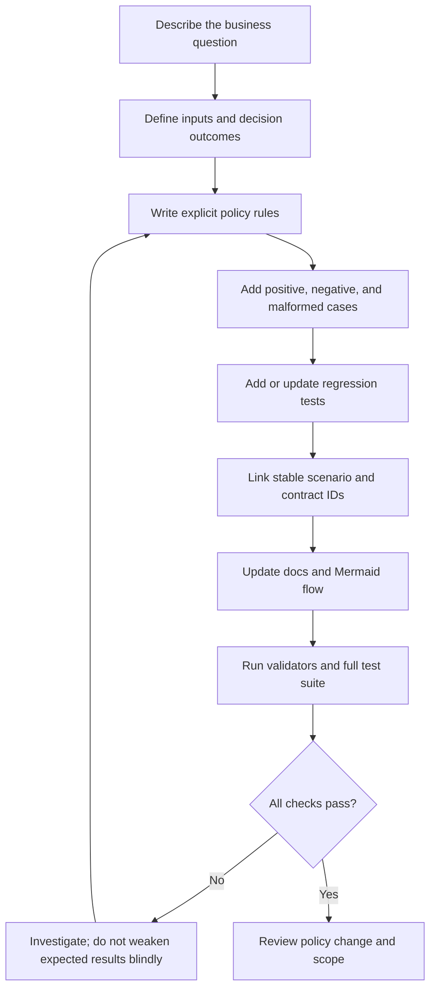

# Extending Project Velvet

This guide describes a repeatable way to add a new scenario, rule, or workflow capability without losing traceability across code, tests, documentation, and the shared dataset.

## The change path



## 1. Start with a decision contract

Before coding, write down:

- **Trigger:** What event, observation, or proposed action starts the evaluation?
- **Required input:** Which fields are mandatory, and what makes them valid?
- **Decision outcomes:** What statuses can be returned?
- **Reasons:** What evidence explains each outcome?
- **Escalation:** What should happen when input is unknown, conflicting, or incomplete?
- **Side-effect boundary:** Is this a recommendation only, or is any action actually performed? In Project Velvet, demos should remain decision-only.
- **Non-goals:** Which related decisions are intentionally out of scope?

Prefer a small, explicit set of outcomes over an ambiguous boolean such as `success=True`.

## 2. Design a useful test matrix

For each policy, consider at least the following categories:

| Case | Purpose |
|---|---|
| Valid / expected | Demonstrate the intended path |
| Boundary value | Check a threshold or version edge |
| Contradictory input | Prevent inconsistent evidence from being accepted silently |
| Duplicate input | Check idempotency-related behavior where applicable |
| Unknown category or action | Verify fail-closed behavior |
| Missing or malformed fields | Verify input validation |
| High-risk case | Confirm escalation or blocking |
| Regression case | Preserve a behavior that previously mattered |

Not every workflow needs every row. Document why a category is irrelevant rather than adding meaningless tests.

## 3. Keep identifiers stable

Use a stable case or scenario ID when a case is referenced by multiple artifacts. A single scenario may be used by:

- the shared JSON data pack;
- a module-level test;
- an agent evaluation case;
- a skill contract;
- a replay record;
- a policy comparison; and
- the documentation or Mermaid walkthrough.

When a case changes meaning, update the relevant expected results and explain the policy change. Avoid renaming IDs merely for cosmetic reasons if other files depend on them.

## 4. Update artifacts together

For a behavior change, check which of these need updating:

1. The policy implementation under `src/velvet/`.
2. Focused tests under `tests/`.
3. Relevant example input/output fixtures under `examples/`.
4. The shared dataset and scenario catalog under `datasets/`, when the case should be reusable.
5. Evaluation cases and governance contracts, where applicable.
6. The relevant `skills/*/SKILL.md` instructions.
7. The Mermaid flow under `docs/*.mmd`.
8. The human-readable explanation in `README.md` or `docs/`.

Not every change touches every file. The goal is to keep the documentation consistent with the implementation, not to duplicate every detail everywhere.

## 5. Treat policy changes differently from refactors

A refactor should preserve the same externally observable decisions. A policy change intentionally changes one or more outcomes.

For a policy change:

- record the baseline and candidate versions;
- identify which cases changed and why;
- inspect newly allowed actions and relaxed approval requirements carefully;
- check whether removed cases reduce regression coverage;
- update expected outputs only after the new behavior is reviewed; and
- run the release-readiness example to see whether the supplied evidence blocks or escalates the change.

A passing test suite means the code matches the current expectations. It does not mean the expectations themselves are correct.

## 6. Keep decision and execution separate

A safe extension should make the boundary visible:

- **Evaluator:** decides whether a proposed path satisfies encoded rules.
- **Orchestrator:** combines results from multiple evaluators.
- **Human review:** handles actions or uncertainty outside the autonomous boundary.
- **Executor:** would perform a real-world action, if a future system had one.

Project Velvet currently demonstrates the first three concepts only. Do not imply that a decision result is an executed operation.

## 7. Local verification

From the repository root, run the relevant example validators and tests:

```bash
python examples/validate_demo_dataset.py
python examples/check_skill_contracts.py
python examples/evaluate_agent_policy.py
python examples/replay_decisions.py
python examples/analyze_policy_impact.py
python examples/release_readiness_report.py
python examples/run_shared_dataset.py
python -m pytest
```

Some examples intentionally demonstrate a blocked or risky candidate. Inspect each script's documented exit behavior rather than assuming every example should end with a successful business decision. CI should distinguish expected negative examples from genuine test failures.

## Review checklist

- [ ] The decision contract and outcomes are explicit.
- [ ] Invalid and unknown inputs are handled conservatively.
- [ ] Reasons explain the evidence behind the decision.
- [ ] Tests cover the main path and meaningful failure modes.
- [ ] Stable IDs and references remain valid.
- [ ] Expected results changed only for an intentional policy change.
- [ ] Mermaid and prose match the implementation.
- [ ] No real customer data or credentials were introduced.
- [ ] No external side effect is implied or performed.
- [ ] Limits and assumptions are documented.
