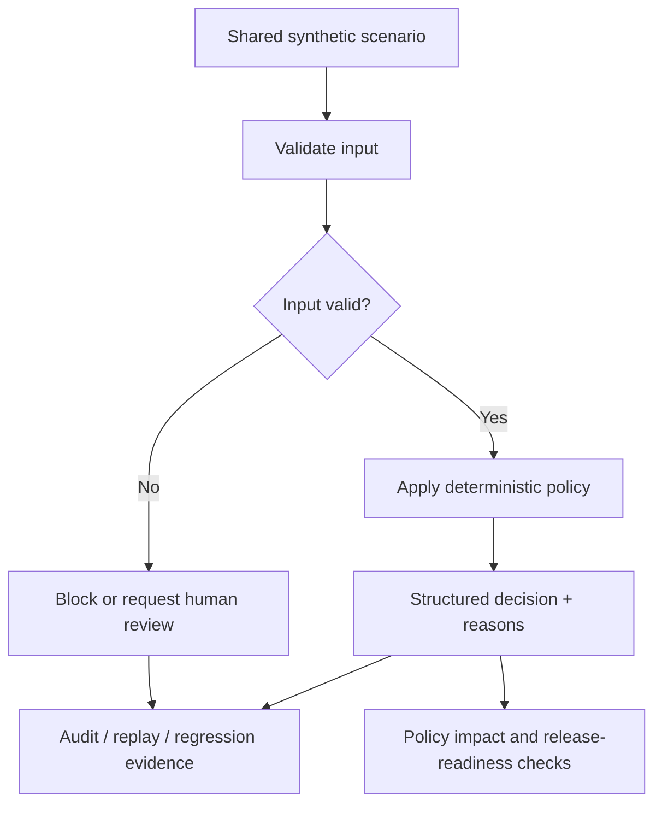

# Project Velvet: Logic Guide

This guide explains the reasoning behind the demo rules, how the modules relate, and what their outputs mean. The repository is a portfolio of deterministic backend workflow examples built around fictional operational data.

## 1. The core design pattern

Each workflow follows the same broad pattern:

1. **Accept a proposed event, observation, or action.**
2. **Validate the input shape and required fields.**
3. **Apply explicit rules** such as allowed transitions, known categories, risk thresholds, or autonomy boundaries.
4. **Return a structured decision** with outcomes and reasons.
5. **Escalate uncertainty or risk** instead of silently guessing.
6. **Record or test the decision** where the demo supports audit, replay, regression, or release checks.

The output is a decision, not a side effect. These examples do not send messages, change orders, adjust inventory, move money, or deploy policies.

## 2. How the workflows fit together



The diagram is conceptual: not every individual demo invokes every other module. The shared scenario runner is the integration point for the linked examples.

## 3. The ten demo capabilities

### Order lifecycle consistency

**Question:** Is this event a valid next step for this order?

The evaluator checks required event information, duplicate event IDs, expected order version, and whether the requested status transition is allowed. This prevents a stale or out-of-order event from being treated as a valid state change.

- A valid transition can be accepted by the policy evaluator.
- A duplicate event or version conflict is not treated as a fresh valid event.
- An unsupported transition, such as jumping directly from a created state to a later state, is rejected.
- Evaluation does not itself update a real order.

### Order exception triage

**Question:** Which operational queue should investigate this exception, and how urgent is it?

The triage policy uses declared fields such as category, age, repeat count, customer impact, and financial risk. It returns a priority, routing suggestion, evidence/reasons, and whether human review is needed.

Unknown categories and malformed input fail closed to manual review. The result is a recommendation; it does not assign a ticket in an external system.

### Order reconciliation

**Question:** Do two snapshots agree on the fields we care about?

The comparison checks status, total, currency, and item count, and reports each mismatch with the expected and observed values. Severity is assigned using the demo's explicit rules.

A mismatch is evidence of disagreement, not proof that one source is correct. The evaluator therefore does not pick an authoritative source or repair either record automatically.

### Audit trail and human review

**Question:** Can a decision and its review disposition be represented separately?

The demo distinguishes the decision evidence from a review outcome. This separation helps preserve what the policy concluded and what a human subsequently decided. The current implementation is in-memory only; it does not provide durable storage or tamper-proof guarantees.

### AI workflow governance

**Question:** Is a proposed agent action inside the allowed autonomy boundary?

The policy distinguishes in-scope read-only/internal work from actions that require approval. Customer communication, financial transactions, order or inventory mutations, and external system changes are approval-gated. Unknown or malformed actions fail closed to manual review.

The governance evaluator does not execute the proposed action. The word “AI” describes the workflow context; the policy decision itself is deterministic.

### Agent evaluation and regression

**Question:** Does the current evaluator still return the expected results for known cases?

Versioned cases contain stable IDs, inputs, and expected output fields. The runner compares actual and expected values, reports mismatches, and exits non-zero when a regression is found.

This tests conformance to encoded examples. It is not a benchmark of a language model's general reasoning, and a green run cannot prove that the cases cover every real-world situation.

### Skill contract testing

**Question:** Are documented skill requirements linked to existing evaluation cases?

The validator checks contract structure, identifiers, mappings, and references to cases. It can catch a broken traceability link, but it cannot prove that a natural-language requirement is complete, correctly interpreted, or adequately tested.

### Decision replay and observability

**Question:** Can a recorded decision be recomputed and compared with its expected result?

Replay provides a repeatable way to inspect decision behavior against stored synthetic records. It makes drift easier to identify when the evaluator or policy changes. Replay is only as meaningful as the input record, expected output, and version context that were preserved.

### Policy change impact analysis

**Question:** What changed between a baseline decision snapshot and a candidate snapshot?

The comparator matches cases by stable ID and identifies changes such as newly allowed actions, relaxed approval requirements, or removed regression cases. The current risk labels are explicit heuristics over the supplied snapshots; they are not a complete business-risk model.

It compares recorded outcomes. It does not execute a candidate policy implementation or determine whether a change is appropriate for the business.

### Release readiness gating

**Question:** Should the proposed policy change be blocked, reviewed, or advanced to human review?

The gate aggregates regression evaluation, contract validation, decision replay, and policy snapshot comparison. Hard failures or high-risk findings block the candidate; medium-risk findings require review; a low-risk result is named `READY_FOR_HUMAN_REVIEW`, not “approved.”

The included candidate is intentionally unsafe so the gate can demonstrate a blocked outcome. No deployment occurs.

### Operational workflow orchestration

**Question:** What should happen when triage, governance, and reconciliation evidence are considered together?

The orchestrator runs the relevant checks in sequence and combines their outputs into a workflow report. A workflow can be blocked, require human review, or be ready for human review. Optional reconciliation evidence contributes context when both snapshots are supplied.

The orchestrator coordinates decisions; it does not execute the proposed action.

## 4. Why “fail closed” matters

When an input is malformed, an action type is unknown, or a policy cannot safely establish permission, the workflow should not infer approval from missing information. In this project, the conservative result is a blocked path or manual review.

This is a design choice for the demo, not a claim that one escalation policy is correct for every organization. Real deployments need explicit owners, service-level targets, exception handling, and tested recovery paths.

## 5. Understanding statuses correctly

- **Allowed / accepted:** the supplied input passed the relevant encoded checks. It does not mean an external action was executed.
- **Approval required / human review:** the workflow has identified a decision that should not proceed autonomously.
- **Blocked / rejected:** a rule or validation check prevented the proposed path.
- **High risk:** a declared heuristic flagged a potentially unsafe change; a human must inspect the evidence.
- **Ready for human review:** the encoded checks passed within the demo's scope. This is not a production release approval.

Always read the reasons and the input case alongside a status label.

## 6. Shared scenarios and reproducibility

The shared dataset in `datasets/operational-demo-pack.json` provides linked fictional orders, lifecycle events, exceptions, proposed actions, snapshots, and policy-change examples. Stable scenario IDs let tests and walkthroughs refer to the same case across modules.

Run the pack with:

```bash
python examples/validate_demo_dataset.py
python examples/run_shared_dataset.py
```

Use `datasets/SCENARIO_CATALOG.md` to see which scenarios demonstrate each behavior. Focused fixtures under `examples/` remain useful for small, single-module demos.

## 7. What this project does not prove

- It does not connect to a commerce platform or process real orders.
- It does not establish that the illustrative policies are appropriate for a real business.
- It does not guarantee completeness, correctness, fairness, or security from passing tests alone.
- It does not evaluate general LLM quality or safely authorize an LLM to perform external actions.
- It does not provide durable audit storage, access control, monitoring infrastructure, or production deployment.

The value of the project is the explicit decision logic, traceability, repeatability, and review boundaries that can be inspected and tested.
